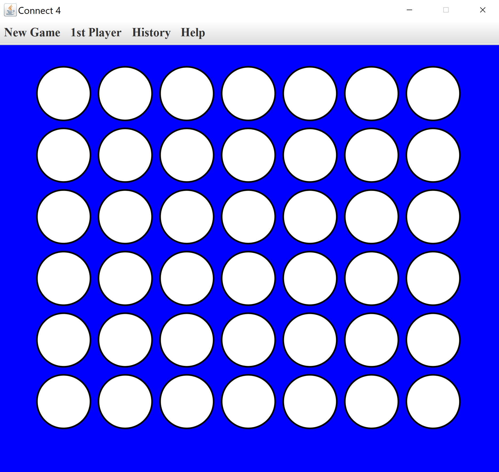

# Connect4 with AI using Java Swing

This Java Swing application allows you to play the classic Connect4 game against an AI opponent, implemented using the Minimax Algorithm with Alpha-Beta Pruning. You can adjust the AI's difficulty level to suit your play style, and review your past matches with the game history feature.

## Table of Contents

- [Getting Started](#getting-started)
  - [Prerequisites](#prerequisites)
  - [How to Run the Application](#how-to-run-the-application)
- [Features](#features)
  - [AI Opponent with Adjustable Difficulty](#ai-opponent-with-adjustable-difficulty)
  - [Game History](#game-history)
- [Project Structure](#project-structure)
- [How to Play](#how-to-play)
- [Screenshot from the GUI](#screenshot-from-the-gui)

## Getting Started

### Prerequisites

Ensure you have Java installed on your computer. You can download Java from [here](https://www.java.com/en/download/).

### How to Run the Application

1. Download the `Connect4.jar` file.
2. Double-click on the `Connect4.jar` file to launch the game.
3. Make sure Java is installed on your system before running the game.

## Features

- **AI Opponent with Adjustable Difficulty:**
  - **Trivial**: Designed for beginners, easy to beat.
  - **Medium**: Balanced difficulty, offering a fair challenge with reasonable decision times.
  - **Hard**: A tough challenge for advanced players, using deeper search in the Minimax algorithm.

- **Game History:**
  - Review previous matches with a history feature.
  - History includes all moves, outcomes, and timestamps.

## Project Structure

- **src:** Contains the source code for the game and AI.
- **lib:** Contains the JSON library JAR file used in the project.

## How to Play

1. Run the `Connect4.jar` file.
2. Select your difficulty level – trivial, medium, or hard.
3. Click on a column to drop your token.
4. The AI will take its turn, and the game continues until there is a winner or a draw.

## Screenshot from the GUI

 make this readme better
